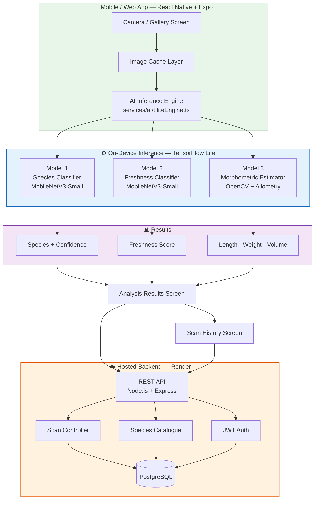
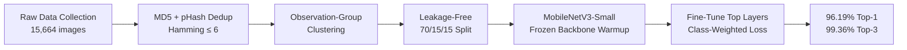
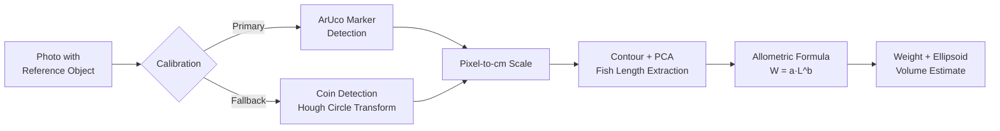

<div align="center">

# 🐟 FishLensAI

### AI-Powered Fish Catch Analysis for South Asian Fisheries

**Identify species. Assess freshness. Estimate weight — all from a single photo.**

[](https://expo.dev)
[](https://www.tensorflow.org/lite)
[](https://pytorch.org)
[](https://www.postgresql.org)
[](LICENSE)

[Live Demo (Web)](https://fish-lens-ai.vercel.app) · [Download APK](https://expo.dev/accounts/saniassagheer/projects/fishlensai/builds/1ab6bae1-23db-473a-9fde-d0e84cd3a779) · [Report Bug](../../issues)

</div>

---

## 📖 Overview

**FishLensAI** is a full-stack mobile application that brings computer vision to the fishing dock and the fish market. A user photographs a fish and the app instantly returns three things a buyer, seller, or fisher actually needs to know: **what species it is**, **how fresh it is**, and **roughly how much it weighs** — all computed on-device, in seconds.

The project was built end-to-end: dataset engineering, model training, computer vision, a React Native mobile app, and a hosted backend — targeting the seven most commercially significant fish species across India and South Asia.

| Capability | Approach | Result |
|---|---|---|
| 🐠 **Species Identification** | MobileNetV3-Small CNN, transfer learning | **96.19%** Top-1 test accuracy |
| 🧊 **Freshness Assessment** | MobileNetV3-Small CNN, 3-class | **81.91%** Top-1 test accuracy |
| 📏 **Weight & Volume Estimation** | Classical CV — reference-object calibration + allometric formulas | Geometric measurement pipeline |

---

## ✨ Features

- 📸 **Live camera scan or gallery upload** — analyze a fish in real time or from an existing photo
- 🎯 **7-species classifier** covering the most commercially important South Asian fish
- 🌡️ **Freshness index** (Fresh / Moderate / Spoiled) with a confidence-driven organoleptic summary
- ⚖️ **Weight & volume estimation** using a coin or printed marker as a physical size reference — no specialized hardware required
- 📚 **Scan history** synced to a cloud backend, with search and freshness filters
- 🔐 **User accounts** (JWT auth) with guest mode for frictionless first use
- 🌐 **Cross-platform**: native Android app (EAS build) + web deployment
- 🔌 **Fully on-device inference** for Models 1 & 2 — no network dependency for the core AI, works offline

---
## 📱 Screenshots

| Welcome | Login | Home Screen | Analysis Result 1 |
| ------- | ----- | ------------ | ------------------ |
|  |  |  |  |

| Analysis Result 2 | Scan History | Settings |
| ------------------ | ------------- | -------- |
|  |  |  |

## 🏗️ System Architecture



---

## 🔬 Model Pipeline & ML Engineering

### Model 1 — Species Classification



Trained on **7 locked species**, sourced from Mendeley research datasets (BD-Freshwater-Fish, Bangladeshi Fish Species Identification Dataset, Indian Seafood Fish Dataset) after building a rigorous, leakage-free data pipeline:

- **Perceptual-hash deduplication** (MD5 exact + pHash near-duplicate clustering, Hamming distance ≤ 6) to catch repeated/near-identical images across merged datasets
- **Observation-group-aware splitting** — near-duplicate clusters are kept entirely within one partition, preventing the same physical fish from leaking across train/val/test
- **Class-weighted loss** to handle a real-world 2.98:1 class imbalance without discarding data
- Iteratively improved from **59.7% → 68.83% → 96.19%** Top-1 accuracy across three rounds of dataset scaling and pipeline fixes

| Species | Scientific Name |
|---|---|
| Rohu | *Labeo rohita* |
| Catla | *Catla catla* |
| Mrigal | *Cirrhinus cirrhosus* |
| Tilapia | *Oreochromis niloticus* |
| Hilsa | *Tenualosa ilisha* |
| Indian Mackerel (Bangda) | *Rastrelliger kanagurta* |
| Pomfret | *Pampus argenteus / Parastromateus niger* |

### Model 2 — Freshness Assessment

A **species-agnostic**, 3-class classifier (Fresh / Moderate / Spoiled), trained on a combined dataset of:
- **FFE** (Freshness of Fish Eyes) — 4,390 labeled images
- **DaFiF** — 2,536 whole-fish images captured over an 11-day ice-storage aging protocol

Reached **81.91% Top-1 accuracy** (macro F1: 0.818) — a result benchmarked directly against published freshness-classification research, where even the best current methods top out around 85–86%. Errors concentrate almost entirely in the inherently ambiguous "Moderate" class, with minimal confusion between the two extremes (Fresh ↔ Spoiled) — the safest possible error profile for a food-quality application.

### Model 3 — Weight & Volume Estimation

No public dataset exists pairing fish photographs with a calibrated size reference for these species — so Model 3 uses a **deterministic computer vision pipeline** instead of a trained model:



Species-specific allometric coefficients (`a`, `b`) are applied per the classified species from Model 1, using established length-weight relationships from ichthyological literature.

---

## 🛠️ Tech Stack

**Mobile App**
- React Native · Expo SDK 51 · TypeScript · Expo Router
- Expo Camera · Expo Image Picker · Expo Secure Store

**Machine Learning**
- PyTorch (training) → ONNX → TensorFlow Lite (on-device inference)
- MobileNetV3-Small (transfer learning, ImageNet pretrained)
- OpenCV (ArUco detection, contour/PCA morphometrics)

**Backend**
- Node.js · Express.js · PostgreSQL
- JWT authentication · RESTful API
- Hosted on Render

**Data Engineering**
- Perceptual hashing (pHash/dHash) for deduplication
- Union-find clustering for observation-group leakage prevention
- Class-weighted training for imbalanced data

---

## 📂 Project Structure

```
FishLensAI/
├── app/                        # Expo Router screens
│   ├── (tabs)/                 # Home, History, Settings
│   ├── scan/                   # Camera, Analyzing, Results
│   └── auth/                   # Login / Register
├── services/
│   ├── ai/                     # Inference engines (mock + TFLite)
│   ├── database/                # Species reference data
│   ├── storage/                # Local scan history
│   └── api/                     # Backend API client
├── ml/
│   ├── src/                    # Training, dedup, export, morphometrics
│   ├── data/                   # Raw + processed datasets (gitignored)
│   ├── models/                 # Trained checkpoints (.pth, .tflite)
│   └── reports/                # Evaluation metrics, confusion matrices
├── backend/
│   ├── controllers/            # Auth, species, scan logic
│   ├── models/                 # PostgreSQL schema
│   └── routes/                 # REST API routes
└── assets/                     # Icons, models, images
```

---

## 🚀 Getting Started

### Prerequisites
- Node.js 18+
- Python 3.11 (for ML pipeline scripts)
- Expo CLI (`npm install -g eas-cli`)

### Installation

```bash
git clone https://github.com/saniasagheer05/FishLensAI.git
cd FishLensAI
npm install
```

### Run the app

```bash
npx expo start
```

Scan the QR code with **Expo Go**, or press `w` for the web preview.

### Backend setup

```bash
cd backend
npm install
cp .env.example .env   # configure your PostgreSQL connection
node models/initDb.js  # run migrations + seed species data
npm start
```

---

## 📊 Results Summary

| Model | Metric | Score |
|---|---|---|
| Species Classification | Top-1 Accuracy | **96.19%** |
| Species Classification | Top-3 Accuracy | 99.36% |
| Species Classification | Macro F1 | 0.9633 |
| Freshness Assessment | Top-1 Accuracy | **81.91%** |
| Freshness Assessment | Macro F1 | 0.8182 |

---

## 🗺️ Roadmap

- [ ] Expand freshness dataset with self-collected samples for remaining species
- [ ] Real-world field validation of the weight/volume estimation pipeline
- [ ] iOS build
- [ ] Play Store release

---

## 📄 License

This project is licensed under the MIT License.

---

<div align="center">

Built by **Sania Sagheer** as a major project in Computer Science & AI

</div>
